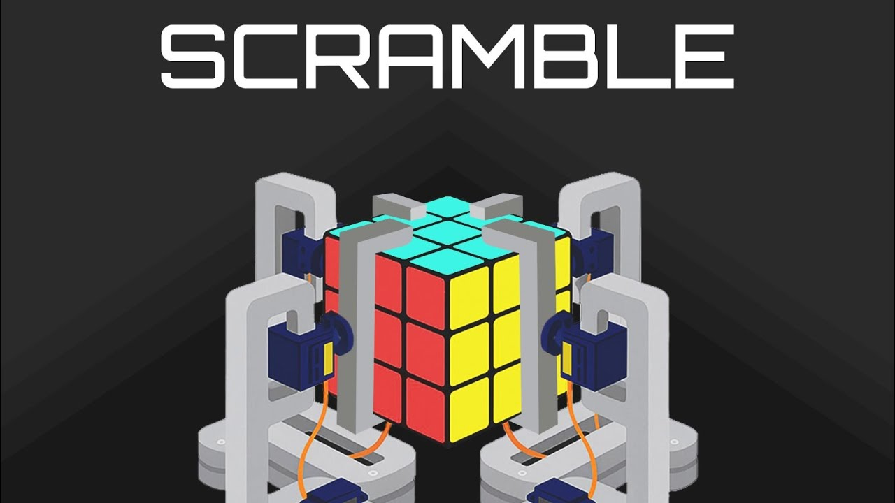
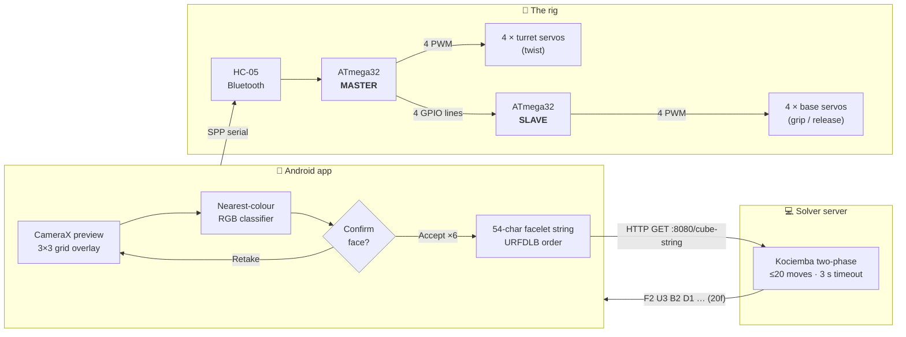
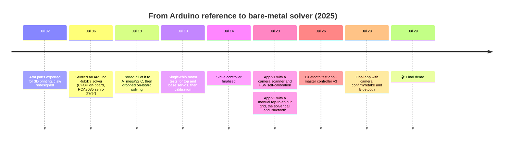

<div align="center">

<a href="https://youtu.be/4RdSLmTVIiQ">
  
</a>

# SCRAMBLE

### A fully automated Rubik's Cube solver built on two bare-metal ATmega32s

*Scan it with your phone. Solve it with Kociemba. Turn it with eight servos.*

<br>

[](https://youtu.be/4RdSLmTVIiQ)


**CSE 316 · Microprocessors, Microcontrollers & Embedded Systems Sessional**
Bangladesh University of Engineering & Technology (BUET)

[How it works](#-how-it-works) ·
[Hardware](#-hardware) ·
[Firmware](#-firmware-the-deep-dive) ·
[Getting started](#-getting-started) ·
[Repo map](#-repository-map) ·
[Journey](#-the-journey)

</div>

---

## ✨ At a glance

| | |
|---|---|
| 🎯 **What** | A robot that takes a scrambled 3×3 cube and solves it with no human help after the scan. |
| 📱 **Eyes** | A custom Android app that scans the six faces with the phone camera, with a confirm or retake step for every face. |
| 🧠 **Brain** | Herbert Kociemba's **two-phase algorithm**, served over HTTP from a laptop on the local network. |
| 📡 **Nerves** | The phone relays moves to an **HC-05** Bluetooth module over the UART. |
| ⚙️ **Muscle** | **8 servos**. Each of the 4 arms has a *turret* servo that twists a face and a *base* servo that drives a rack-and-pinion to grip and release. |
| 🔩 **Silicon** | **Two ATmega32s in a master/slave pair**, programmed in plain AVR C with no Arduino and no libraries. |

<div align="center">

### 🎬 [Watch SCRAMBLE solve a cube on YouTube →](https://youtu.be/4RdSLmTVIiQ)

</div>

---

## 🧩 How it works



### The end-to-end run

1. **Scan.** The app walks you through **U → R → F → D → L → B**. A live overlay shows the colour detected in each of the 9 stickers.
2. **Verify.** After each capture the app shows a confirmation grid. If the lighting fooled the camera, hit **Retake** and scan that face again.
3. **Serialise.** The six faces are flattened into a **54-character string** in Kociemba's facelet order, for example `DUUBULDBFRBFRRULLLBRDFFFBLURDBFDFDRFRULBLUFDURRBLBDUDL`.
4. **Solve.** The app sends `GET http://<laptop>:8080/<string>`. The server returns something like `F2 U3 F2 U3 B2 D1 L2 … (20f)`, where the digit is the number of clockwise quarter turns.
5. **Transmit.** The phone opens an RFCOMM (SPP) socket to the paired **HC-05** and streams the commands.
6. **Execute.** The master turns every move into a timed choreography of grip, twist, release and return across the two MCUs.
7. **Solved.** 🎉

---

## 🔧 Hardware

<table>
<tr><td>

| Qty | Part | Role |
|:-:|---|---|
| 2 | **ATmega32** (internal 1 MHz RC) | Master and slave controllers |
| 1 | **HC-05** Bluetooth module | Phone ↔ master UART bridge at 9600 baud |
| 4 | Servo, *turret* (SG90-class) | Twists a face by 90° |
| 4 | Servo, *base* | Drives the gear → rack to push the claw in or out |
| 4 | 3D-printed arm sets | Base, turret, claw, gear and rack ([`hardware/`](hardware/)) |
| 1 | External 5 V supply | Servos. All grounds are tied together |

</td></tr>
</table>

### Turning rotation into a grip

The cube is held by **four identical arms** on the F, B, L and R sides. Each arm has two degrees of freedom:

- **Base servo → gear → rack.** The servo's rotation drives a pinion gear along a rack and converts it to **linear motion**, which slides the whole turret toward the cube (grip) or away from it (release).
- **Turret servo → claw.** The claw is mounted on the servo horn and **rotates** the gripped face by 90°.

U and D have no arm. They are reached by **re-orienting the whole cube**: two opposite arms grip and roll it, then the move is done as an F turn and the cube is rolled back. See `Rotate_top()` and `Rotate_bottom()` in [`master_controller.c`](firmware/master/master_controller.c).

---

## 🔬 Firmware: the deep dive

### Why two microcontrollers?

A servo needs a steady ~50–60 Hz pulse whose width sets its angle. To generate that in **hardware**, with jitter-free output and the CPU free for the UART, you need a timer compare output pin. The ATmega32 has exactly **four**:

| Timer | Width | Compare outputs | Pin | Servos |
|---|:-:|---|:-:|:-:|
| Timer 0 | 8-bit | OC0 | PB3 | 1 |
| Timer 1 | **16-bit** | OC1A, OC1B | PD5, PD4 | 2 |
| Timer 2 | 8-bit | OC2 | PD7 | 1 |
| | | | **Total** | **4** |

That's **4 servos per chip**, and the rig needs **8**. Rather than bit-banging PWM in software or bolting on a PCA9685 (we [tried porting one](archive/firmware/atmega32-cfop-port/pca9685_atmega32.c)), we used two ATmega32s.

### PWM timing at 1 MHz

| Timer | Mode | Prescaler | Tick | Period | Resolution |
|---|---|:-:|:-:|:-:|:-:|
| Timer 1 | Fast PWM, `TOP = ICR1 = 2048` | 8 | 8 µs | ≈16.4 ms (≈61 Hz) | fine: 135 steps between 0° and 90° |
| Timer 0 / 2 | Fast PWM, 8-bit | 64 | 64 µs | ≈16.4 ms (≈61 Hz) | coarse: ~17 steps between 0° and 90° |

All three timers run at the **same ≈61 Hz** frame, so every servo sees a consistent signal. The 8-bit timers' 64 µs steps are why their calibration constants are small numbers like `7` and `24`.

### Master ↔ slave link

There's no bus protocol. Each base servo has only two positions, so the link is **four plain logic levels**:

```
 MASTER                     SLAVE
 PC0 ───────────────────▶  PC0   Base Front   HIGH = grip (max) · LOW = release (min)
 PC1 ───────────────────▶  PC1   Base Back
 PA2 ───────────────────▶  PC2   Base Left
 PA3 ───────────────────▶  PC3   Base Right
 GND ───────────────────── GND   (common ground is mandatory)
```

The slave polls `PINC` every 10 ms and sets its `OCRx` registers to match. Changing a pin on the master makes the servo move almost instantly, with no handshake and no framing errors.

### Pin map

<details>
<summary><b>Master ATmega32</b></summary>

| Pin | Function |
|---|---|
| PD0 / PD1 | USART RX / TX ↔ HC-05 (9600 baud, `U2X` on) |
| PD4 (OC1B) | Turret servo, **Front** |
| PD5 (OC1A) | Turret servo, **Back** |
| PD7 (OC2) | Turret servo, **Left** |
| PB3 (OC0) | Turret servo, **Right** |
| PC0, PC1, PA2, PA3 | → Slave PC0–PC3 |

</details>

<details>
<summary><b>Slave ATmega32</b></summary>

| Pin | Function |
|---|---|
| PC0–PC3 | ← Master (Front, Back, Left, Right) |
| PD4 (OC1B) | Base servo, **Front** |
| PD5 (OC1A) | Base servo, **Back** |
| PD7 (OC2) | Base servo, **Left** |
| PB3 (OC0) | Base servo, **Right** |

</details>

### Bluetooth command set (master)

| Byte | Action | | Byte | Action |
|:-:|---|---|:-:|---|
| `F` `B` `L` `R` | Turret → 0° | | `f` `b` `l` `r` | Turret → 90° |
| `W` `X` `Y` `Z` | Base F/B/L/R → release | | `w` `x` `y` `z` | Base F/B/L/R → grip |
| `S` | Run the stored solve sequence | | `A` | Test: run `U3` |

Single-byte commands let you **jog every servo by hand** from any Bluetooth serial terminal, which is how the rig was calibrated.

### Anatomy of a move

A clockwise quarter turn of the right face (`R1`) is four timed steps:

```
Base_Right_Min()    ── release the right claw
Top_Right_0_Deg()   ── pre-rotate the empty claw
Base_Right_Max()    ── grip the R face
Top_Right_90_Deg()  ── twist it 90°  ✔
```

`R3` (counter-clockwise) runs the same steps in mirror order, and `R2` is two of them. `U` and `D` moves wrap an `F` move between whole-cube rolls. Every step waits 900 ms so the servos settle.

➡️ Full details: [`firmware/README.md`](firmware/README.md)

---

## 🚀 Getting started

### 1 · Solver server (laptop)

```bash
cd solver-server
pip install numpy requests
python start_server.py 8080 20 3      # port · max moves · timeout (s)
```

> ⏳ The **first run takes a while**. The server builds about 70 MB of pruning tables into `twophase/`. Later starts load them from disk.

Smoke-test it from a second terminal:

```bash
python test_client.py
```

### 2 · Android app

1. Open [`android-app/`](android-app/) in Android Studio. It needs SDK 36 and min SDK 24.
2. Set the server address in `MainActivity.kt` → `sendRequestToServer()` to your laptop's LAN IP.
3. Pair the phone with the **HC-05** (default PIN `1234`), then build and run.

### 3 · Firmware

```bash
cd firmware
make                       # builds master.hex and slave.hex with avr-gcc
make flash-master          # avrdude + USBasp; swap the chip, then:
make flash-slave
```

Both chips run on the **factory-default 1 MHz internal oscillator**, so no fuse changes are needed. Calibrate the `*_DEG`, `*_MIN` and `*_MAX` constants for your servos before the first run.

---

## 🗂 Repository map

```
SCRAMBLE/
├── firmware/            ⭐ FINAL  ATmega32 master + slave (AVR C)
├── android-app/         ⭐ FINAL  Kotlin · CameraX scanner · OkHttp · Bluetooth SPP
├── solver-server/       ⭐ FINAL  Kociemba two-phase solver + HTTP server (vendored, GPL-3.0)
├── hardware/            ⭐ FINAL  Print-ready STLs · FreeCAD sources · assembly drawings
├── docs/                         Banner · project proposals · provenance map
├── archive/             🧪 EXPLORATION  earlier apps, firmware ports, motor tests, upstream reference
└── coursework/          📚 UNRELATED  CSE 316 assembly onlines/offlines and lab sheets
```

| Folder | Status | What's inside |
|---|:-:|---|
| [`firmware/`](firmware/) | ⭐ final | `master_controller.c`, `slave_controller.c`, Makefile |
| [`android-app/`](android-app/) | ⭐ final | The app from the demo: scan → confirm/retake → solve → send |
| [`solver-server/`](solver-server/) | ⭐ final | [hkociemba/RubiksCube-TwophaseSolver](https://github.com/hkociemba/RubiksCube-TwophaseSolver) + our `test_client.py` |
| [`hardware/`](hardware/) | ⭐ final | `stl-print-ready/`, `freecad-source/`, `blueprints/` |
| [`docs/`](docs/) | 📄 | Proposal decks, [`PROVENANCE.md`](docs/PROVENANCE.md) (raw folder → repo map) |
| [`archive/`](archive/) | 🧪 exploration | See [`archive/README.md`](archive/README.md) for each experiment and why it was dropped |
| [`coursework/`](coursework/) | 📚 unrelated | Kept for completeness; not part of SCRAMBLE |

---

## 🛤 The journey

SCRAMBLE started as a fork of an Arduino project and ended as something quite different.



Key decisions along the way:

- **On-chip CFOP → off-board Kociemba.** The Arduino reference solved the cube on the MCU with a layer-by-layer CFOP method. We ported it to ATmega32 C, then moved solving to a laptop running the two-phase algorithm, which caps solutions at 20 moves. Every move costs several seconds of servo time.
- **PCA9685 → second ATmega32.** This kept everything in raw-register territory with no external PWM driver.
- **Manual colour entry → camera + human confirm.** One app iteration had you tap in every sticker. The final app scans with the camera but keeps a human in the loop through confirm and retake.

See [`archive/README.md`](archive/README.md) for the full exploration log.

---

## ⚠️ Known limitations

- **The firmware snapshot predates the final app protocol.** The final app sends `P` (program), each move token (`F2`, `U3`, … with `)` on the last), then `S` (execute). The newest `master_controller.c` in the source dump (Jul 26) handles `S` with a hard-coded sequence and has no `P` or move-buffer handler. The firmware that ran in the demo was likely edited after the last saved snapshot.
- The server IP is hard-coded in the app.
- The colour references are tuned for one specific cube under one specific light.
- Moves are open-loop with fixed 900 ms delays, so a missed grip isn't detected.

---

## 🙏 Credits

- **Two-phase solver:** [Herbert Kociemba — RubiksCube-TwophaseSolver](https://github.com/hkociemba/RubiksCube-TwophaseSolver) (GPL-3.0). Vendored unmodified in [`solver-server/`](solver-server/).
- **Mechanical design:** the open-source *Arduino-RubikSolver* project (public domain / Unlicense). The arm parts in [`hardware/freecad-source/`](hardware/freecad-source/) are its FreeCAD files. We re-exported them for 3D printing and redesigned the claw (`Claw2.stl`). A source snapshot of the project is kept in [`archive/upstream-reference/`](archive/upstream-reference/).

### Team

<!-- TODO: fill in names, student IDs and GitHub handles -->
| Name | Student ID | GitHub |
|---|---|---|
| Sakif Naieb Raiyan | | |
| | 2105065 | |

<div align="center">
<br>
<sub>Built at BUET for CSE 316 · 2025</sub>
</div>
