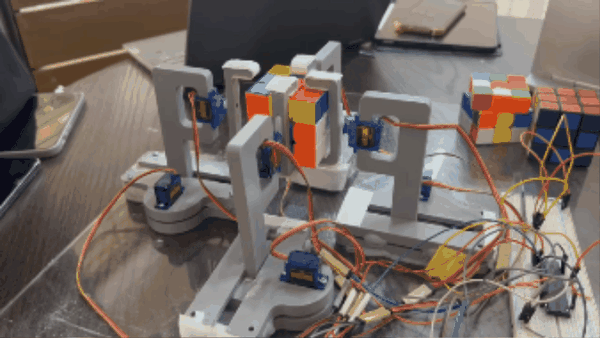
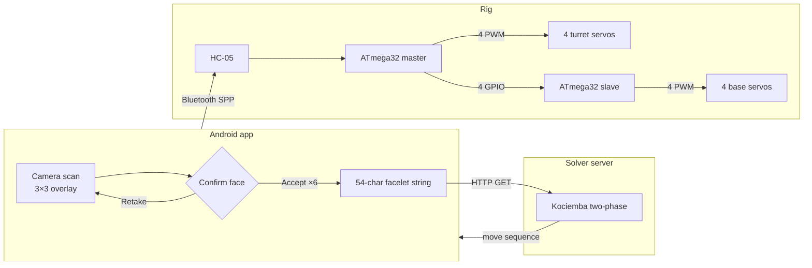
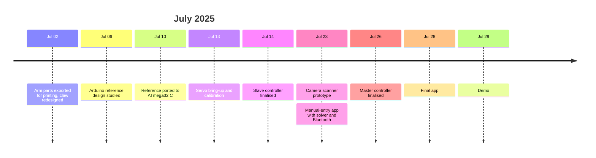

<div align="center">

# SCRAMBLE

**An autonomous Rubik's Cube solver driven by two bare-metal ATmega32 microcontrollers**



[](https://youtu.be/4RdSLmTVIiQ)


CSE 316 · Bangladesh University of Engineering and Technology

</div>

---

## Overview


SCRAMBLE solves a scrambled 3×3 cube with no human input beyond the initial scan. An Android app reads the cube's state through the phone camera, a laptop computes a solution of at most 20 moves using Kociemba's two-phase algorithm, and the phone relays it over Bluetooth to a rig of eight servos controlled by two ATmega32s.

The firmware is written in plain AVR C against the hardware registers, without Arduino or any third-party libraries.

<br clear="right">

## System architecture



1. **Scan.** The app guides the user through the faces in U, R, F, D, L, B order. It classifies each sticker by nearest RGB match and asks for confirmation, so a misread face can be retaken.
2. **Solve.** The six faces are serialised into Kociemba's 54-character facelet string and sent to the server, which returns a sequence such as `F2 U3 B2 D1 … (20f)`. The digit is the number of clockwise quarter turns.
3. **Execute.** The phone streams the moves to the HC-05. The master translates each one into a timed sequence of grips and twists shared across both controllers.

## Hardware

| Qty | Component | Role |
|:-:|---|---|
| 2 | ATmega32, internal 1 MHz oscillator | Master and slave controllers |
| 1 | HC-05 Bluetooth module | UART bridge to the phone, 9600 baud |
| 4 | Turret servo (SG90 class) | Rotates a face by 90° |
| 4 | Base servo | Drives a rack and pinion to grip or release |
| 4 | 3D-printed arm assemblies | See [`hardware/`](hardware/) |
| 1 | External 5 V supply | Servo power, common ground with both MCUs |

Four identical arms hold the F, B, L and R faces. Each arm has two degrees of freedom. The base servo turns a pinion along a rack, converting rotation into the linear motion that moves the claw onto or off the cube. The turret servo then rotates the gripped face. The U and D faces have no arm, so the rig reaches them by rolling the whole cube, performing an F turn, and rolling it back.

## Firmware

### Why two microcontrollers

Servos need a steady pulse train, and generating it in hardware keeps the timing jitter-free while the CPU services the UART. The ATmega32 has exactly four hardware PWM outputs:

| Timer | Width | Outputs | Pins |
|---|:-:|---|---|
| Timer 0 | 8-bit | OC0 | PB3 |
| Timer 1 | 16-bit | OC1A, OC1B | PD5, PD4 |
| Timer 2 | 8-bit | OC2 | PD7 |

That allows four servos per chip against the rig's eight. A second ATmega32 was preferred over software PWM or an external PCA9685 driver.

### PWM timing

All three timers run in fast PWM mode with the same period of about 16.4 ms (61 Hz). Timer 1 uses `ICR1 = 2048` with a prescaler of 8, which gives an 8 µs tick and fine positioning. Timers 0 and 2 use a prescaler of 64, giving a 64 µs tick. That coarser step is why their calibration values are small integers such as 7 and 24.

### Master–slave interface

Each base servo has only two positions, so the interface is four logic levels with no protocol at all. The slave polls them every 10 ms and updates its compare registers.

| Master | Slave | Base servo |
|:-:|:-:|---|
| PC0 | PC0 | Front |
| PC1 | PC1 | Back |
| PA2 | PC2 | Left |
| PA3 | PC3 | Right |

A HIGH level means grip and a LOW level means release. Both controllers share a common ground.

### Command set

| Byte | Action | Byte | Action |
|:-:|---|:-:|---|
| `F B L R` | Turret to 0° | `f b l r` | Turret to 90° |
| `W X Y Z` | Base release | `w x y z` | Base grip |
| `S` | Run the stored solve sequence | `A` | Test move (`U3`) |

The single-byte commands allow each servo to be jogged from a Bluetooth terminal, which is how the rig was calibrated. A quarter turn such as `R1` takes four steps: release, pre-rotate the empty claw, grip, then twist. Each step is followed by a 900 ms settling delay. Pin maps and calibration constants are in [`firmware/README.md`](firmware/README.md).

## Getting started

**Solver server**

```bash
cd solver-server
pip install numpy requests
python start_server.py 8080 20 3     # port, max moves, timeout in seconds
python test_client.py                # in a second terminal
```

The first launch generates about 70 MB of pruning tables, which takes several minutes. Later launches load them from disk.

**Android app.** Open [`android-app/`](android-app/) in Android Studio (SDK 36, minimum 24). Set the laptop's LAN address in `MainActivity.kt` under `sendRequestToServer()`, pair the phone with the HC-05, then build.

**Firmware**

```bash
cd firmware
make                 # builds master.hex and slave.hex
make flash-master    # USBasp by default
make flash-slave
```

Both chips run on the factory-default fuses. Calibrate the servo constants for your hardware before the first run.

## Repository structure

| Path | Contents |
|---|---|
| [`firmware/`](firmware/) | Master and slave controllers, Makefile |
| [`android-app/`](android-app/) | Scanner and controller app used in the demo |
| [`solver-server/`](solver-server/) | Kociemba's two-phase solver (vendored) and a test client |
| [`hardware/`](hardware/) | Print-ready STLs, FreeCAD sources, assembly drawings |
| [`docs/`](docs/) | Proposal decks and a [provenance map](docs/PROVENANCE.md) of the original working folder |
| [`archive/`](archive/) | Superseded prototypes and experiments, [catalogued here](archive/README.md) |
| [`coursework/`](coursework/) | Unrelated CSE 316 coursework |

## Development history



The project began from an open-source Arduino solver that ran a CFOP solver on the microcontroller and drove its servos through a PCA9685. Three decisions moved it away from that design:

- **Solving moved off the chip.** The two-phase algorithm caps solutions at 20 moves, and each move costs several seconds of servo time.
- **The PCA9685 was replaced by a second ATmega32**, which kept all servo control in native timer hardware.
- **Scanning kept a human in the loop.** An intermediate version used manual colour entry. The final app scans with the camera and asks for confirmation of each face.

## Known limitations

- The server address is hard-coded in the app.
- Colour references are tuned to one cube under one lighting setup.
- Motion is open-loop with fixed delays, so a failed grip goes undetected.

## Acknowledgements

- [**RubiksCube-TwophaseSolver**](https://github.com/hkociemba/RubiksCube-TwophaseSolver) by Herbert Kociemba (GPL-3.0), included unmodified in `solver-server/`.
- **Arduino-RubikSolver** (public domain), the source of the arm's FreeCAD design. We re-exported the parts for printing and redesigned the claw. A snapshot is kept in [`archive/upstream-reference/`](archive/upstream-reference/).

## Team

| Name | Student ID |
|---|:-:|
| Sakif Naieb Raiyan | 2105065 |
| Sayaad Muzahid Masfi | 2105066 |
| Aurchi Chowdhury | 2105083 |
